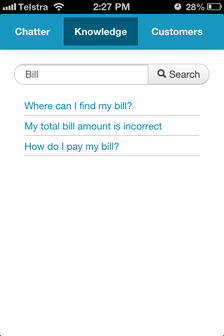

#Store Connect

### Connecting your stores with Collaboration, Knowledge and Customer insight

Store Connect is a responsive HTML app built on the [Force.com](http://www.force.com) platform whose target used base are retail store employees.
It provides them access to the corporate chatter feed to exchange thoughts, ideas with other retail employees across stores as well as provide a channel for secure corporate communications.

#### Quick overview 

From the user view point, Store Connect is a three page app:

* Home/Chatter
	* Chatter feed using the [Connect in Apex API](http://developer.force.com/cookbook/recipe/connect-in-apex-pilot)
	
* Knowledge
	* Search across and display all KB articles that the user has access to
	* Ability to email link to Public Knowledge Base (PKB) article to customer
	* Can capture and create a new customer record if they do not currently exist (Lead Creation)
	* Fields displayed can be configured via Field Sets
	
* Customers
	* Quick SOSL search across all contact fields
	* Display of Field Set driven contact fields
	
	

#### Installation

* Pre-Requisites
	* Salesforce Developer Edition Org
	* Salesforce Knowledge Enabled	
	* Salesforce Sites Enabled
	* Salesforce Connect in Apex enabled
* Installation
	* I exported this using [Workbench](https://workbench.developerforce.com/) and you can import into your salesforce Org using the Workbench Deploy function which is inside migration->Deploy.
	
----

**Please Note**
This project is still in progress and is not 100% complete.  Things still on the TODO list are:
* Chatter Page
	* Enable comment creation
	* Enable comment like-ing
* Knowledge
	* Fix layout of additional contact fields on tablets
	* Restrict emailing of PKB links ONLY to article types which have been enabled for the PKB
	* Show something when the search results are empty
* Customers
	* Doesn't cater properly for Person Accounts
	* Show something when the serach results are empty
* General
	* Style - Code Clean up (remove CSS from main pages, etc)
	* Look at smoothing out the scrolling toolbar (it's kinda jumpy)
	* Make a few more things configurable (i.e. text of search pages)
	* Look at using backbone.js to abstract data-model from the DOM

----

### Change Log ###

17.04.2013 - Initial Code Commit

